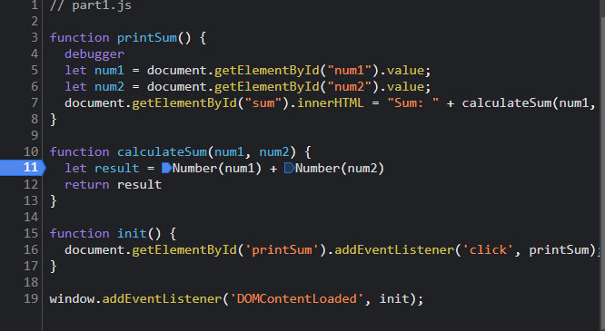

1. The bug was that when two numbers were summed up the sum function would concatenate the strings of the numbers together instead of adding them as integers. Therefore, the result was also a string typed variable.

2. My fix was to first convert num1 and num2 to an integer type in the calculateSum function. 